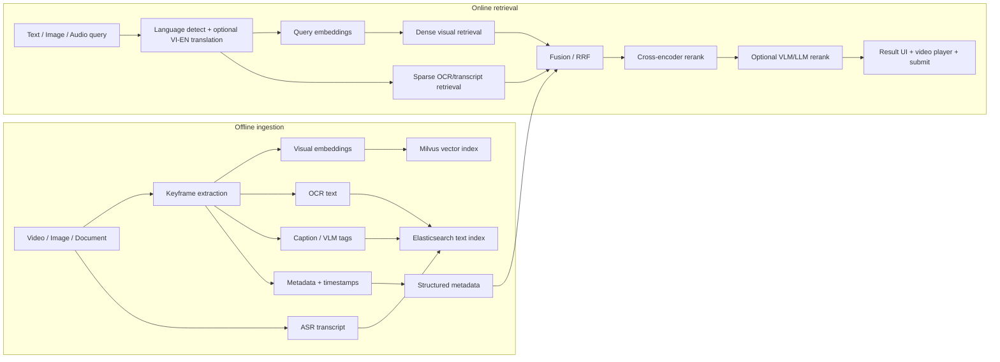

# Video Retrieval System for AI Challenge

Tài liệu này giải thích cách xây hệ thống truy xuất video đa phương thức cho AI Challenge theo hướng **nhanh, dễ debug, chính xác dần theo từng tầng**. Mục tiêu không phải nhồi một model thật lớn vào mọi thứ, mà là thiết kế pipeline biết kết hợp nhiều tín hiệu: hình ảnh, chữ trong frame, lời thoại, caption/ngữ cảnh và metadata thời gian.

Repo hiện tại đã có baseline tốt: Flask backend, Milvus vector search, Elasticsearch transcript search, OpenCLIP embedding, Whisper ASR, keyframe extraction, giao diện web xem video và submit frame. Bản README này trình bày lại tư duy, luồng xử lý, công nghệ nên dùng và cách nâng cấp để thi đấu.

## Ý Tưởng Cốt Lõi

Trong video retrieval, không nên phụ thuộc vào một loại score duy nhất.

Ví dụ query:

```text
người cầm ô đứng cạnh xe màu đỏ trong trời mưa
```

Một frame đúng có thể được phát hiện nhờ nhiều tín hiệu khác nhau:

- Visual embedding thấy cảnh có người, ô, xe, mưa.
- OCR thấy chữ trên biển hiệu hoặc phụ đề.
- Transcript/ASR nghe thấy lời thoại liên quan.
- Caption/VLM mô tả quan hệ giữa người, vật và bối cảnh.
- Metadata biết video id, timestamp, keyframe mapping, FPS.

Vì vậy hệ thống tốt nên có 3 tầng:

```text
1. Candidate generation: lấy thật nhanh nhiều ứng viên có khả năng đúng.
2. Fusion: gộp kết quả từ visual/OCR/transcript/caption.
3. Reranking: sắp xếp lại top kết quả để đáp án đúng lên cao.
```

## Sơ Đồ Luồng Tổng Quát



## Repo Hiện Tại Có Gì

| Phần | File chính | Trạng thái |
| --- | --- | --- |
| Flask API | [backend/app.py](backend/app.py) | Đã có |
| Search engine | [backend/retrieval_system.py](backend/retrieval_system.py) | Đã có visual + transcript |
| Config | [backend/config.py](backend/config.py) | Đã có, còn hardcode |
| Ingest Milvus/ES | [backend/ingest_data.py](backend/ingest_data.py) | Đã có |
| Keyframe extraction | [scripts/extract_keyframes.py](scripts/extract_keyframes.py) | Đã có |
| CLIP embedding | [scripts/compute_embeddings.py](scripts/compute_embeddings.py) | Đã có baseline |
| Whisper transcript | [scripts/extract_transcripts.py](scripts/extract_transcripts.py) | Đã có |
| Web UI | [templates/index.html](templates/index.html), [static/js](static/js) | Đã có |
| Docker DB | [docker-compose.yml](docker-compose.yml) | Milvus + Elasticsearch |

Điểm cần nâng cấp:

- Visual model hiện là `OpenCLIP ViT-B-32`, chỉ nên xem là baseline.
- OCR chưa được nối vào search chính.
- Fusion hiện còn đơn giản, chưa có RRF/hybrid đầy đủ.
- Chưa có reranker.
- Backend/model serving chưa container hóa GPU.
- Config evaluation/server/model nên chuyển sang `.env`.

## Luồng Xử Lý Offline

Offline ingestion là phần chuẩn bị dữ liệu trước khi thi hoặc trước khi search. Làm tốt phần này thì online search mới nhanh.

### 1. Chuẩn bị video

Đưa video vào:

```text
data/videos/L01_V001.mp4
data/videos/L01_V002.mp4
```

Tên file nên là `video_id`, vì toàn bộ hệ thống dùng tên file để map keyframe, transcript, metadata và submit.

### 2. Extract keyframes

```powershell
python -m scripts.extract_keyframes --method interval --interval 2.0
```

Kết quả:

```text
data/keyframes/L01_V001/keyframe_0.webp
data/keyframes/L01_V001/keyframe_1.webp
data/keyframes/maps/L01_V001_map.csv
```

File map rất quan trọng:

```csv
FrameID,Seconds,OriginalFrame
0,0.0,0
1,2.0,50
2,4.0,100
```

Nó giúp biết `keyframe_1.webp` tương ứng giây nào và frame gốc nào trong video.

### 3. Tính visual embeddings

Baseline hiện tại:

```powershell
python -m scripts.compute_embeddings --batch-size 32 --device cuda
```

Kết quả:

```text
data/embeddings/L01_V001/keyframe_0.pt
data/embeddings/L01_V001/keyframe_1.pt
```

Model hiện tại là `OpenCLIP ViT-B-32`. Đây là baseline nhanh, nhẹ, dễ chạy. Khi cần tăng accuracy, nên nâng theo thứ tự:

```text
OpenCLIP ViT-B-32
-> SigLIP2 base
-> SigLIP2 so400m
-> jina-clip-v2 nếu cần multilingual image-text mạnh hơn
```

Lưu ý: embedding từ model khác nhau không nên trộn chung một collection nếu chưa lưu `model_name`, `dimension`, `normalized`.

### 4. Extract transcript bằng ASR

Hiện có:

```powershell
python -m scripts.run_transcript_pipeline --model large --language vi
```

Khuyến nghị thi đấu:

```text
openai-whisper: dễ dùng, baseline ổn
faster-whisper: nhanh hơn khi chạy GPU, hợp production/competition
large-v3: ưu tiên accuracy
medium/small: dùng khi GPU yếu hoặc cần ingest nhanh
```

Kết quả transcript nên có:

```json
{
  "video_id": "L01_V001",
  "language": "vi",
  "segments": [
    {
      "start": 12.3,
      "end": 15.1,
      "text": "..."
    }
  ]
}
```

### 5. OCR keyframes

Đây là phần rất nên thêm cho AI Challenge. Nhiều đáp án nằm trong:

- chữ trên màn hình,
- biển báo,
- logo,
- phụ đề,
- slide,
- bảng,
- tiêu đề chương trình.

Luồng đề xuất:

```text
keyframe images
-> PaddleOCR PP-OCRv5
-> OCR JSON
-> Elasticsearch text index
```

Không nên chạy VLM OCR nặng trên toàn bộ keyframe ngay từ đầu. Cách thực dụng:

```text
PaddleOCR nhẹ chạy toàn bộ corpus
PaddleOCR-VL hoặc Florence-2 chỉ chạy top candidates khi cần hiểu layout/chữ phức tạp
```

### 6. Caption hoặc VLM tags

Caption giúp bổ sung ngữ cảnh mà visual embedding đôi khi không biểu diễn rõ.

Ví dụ frame có:

```text
một người đàn ông mặc áo xanh đang đứng cạnh xe cứu thương
```

Caption text này có thể index vào Elasticsearch giống transcript/OCR. Tuy nhiên, caption/VLM khá nặng, nên ưu tiên sau OCR và transcript.

### 7. Ingest vào database

```powershell
python -m backend.ingest_data
```

Hiện script làm 2 việc:

- Ingest embedding `.pt` vào Milvus collection `video_keyframes`.
- Ingest transcript JSON/CSV vào Elasticsearch index `video_transcripts`.

Sau này nên mở rộng để ingest thêm:

```text
OCR text
caption text
text dense embedding
model metadata
timestamp metadata
```

## Luồng Xử Lý Online Khi User Search

Online retrieval là phần chạy khi người dùng nhập query trên UI.

### Bước 1. Nhận query

Ví dụ:

```json
{
  "description": "người cầm ô đứng cạnh xe màu đỏ"
}
```

Hoặc:

```json
{
  "transcript": "hôm nay trời mưa rất lớn"
}
```

### Bước 2. Tiền xử lý query

Nên làm:

- detect tiếng Việt/Anh,
- chuẩn hóa dấu câu/khoảng trắng,
- optional dịch Việt -> Anh nếu visual model hiểu tiếng Anh tốt hơn,
- giữ cả query gốc và query dịch.

Ví dụ:

```text
query_vi = "người cầm ô đứng cạnh xe màu đỏ"
query_en = "a person holding an umbrella standing next to a red car"
```

Sau đó search cả hai nếu latency cho phép.

### Bước 3. Dense visual retrieval

Query text được encode thành vector, rồi search Milvus:

```text
query -> text encoder -> vector -> Milvus -> top 200/500 keyframes
```

Kết quả gồm:

```json
{
  "video_id": "L01_V001",
  "keyframe_index": 17,
  "frame_number": 850,
  "start_seconds": 34.0,
  "clip_score": 0.337
}
```

### Bước 4. Sparse text retrieval

Query cũng search trên Elasticsearch:

```text
query -> Elasticsearch -> transcript/OCR/caption matches
```

Text search rất mạnh khi query chứa tên riêng, số, chữ trên màn hình hoặc lời thoại.

### Bước 5. Fusion

Không nên so trực tiếp:

```text
CLIP score 0.33
Elasticsearch score 12.5
OCR score 8.1
```

Vì mỗi hệ có scale khác nhau. Cách dễ và ổn nhất là dùng RRF:

```text
rrf_score = sum(1 / (k + rank_i))
```

Với `k = 60`.

Ví dụ:

```text
Frame A rank visual = 2, rank OCR = 20
Frame B rank visual = 10, rank OCR = 1
```

RRF sẽ gộp theo thứ hạng, không cần ép score về cùng scale.

### Bước 6. Rerank

Sau fusion, lấy top 50 đưa vào reranker:

```text
query + OCR + transcript + caption + metadata -> reranker -> final ranking
```

Reranker khuyến nghị:

```text
BAAI/bge-reranker-v2-m3
```

Vì model này multilingual, hợp Việt-Anh và nhẹ hơn các reranker LLM lớn.

### Bước 7. UI và submit

Frontend hiển thị result card. Khi click:

- mở video,
- seek tới `start_seconds`,
- cho nhảy từng frame,
- tính `timeMs`,
- submit lên evaluation server.

Công thức submit:

```text
currentFrame = floor(currentTime * fps)
timeMs = round((currentFrame / fps) * 1000)
```

## Vì Sao Score 0.3x Vẫn Có Thể Là Cao

Score từ CLIP/SigLIP/OpenCLIP không phải phần trăm đúng.

Nó thường là cosine similarity hoặc inner product giữa query vector và image vector. Với CLIP baseline, score đúng có thể chỉ quanh:

```text
0.20 - 0.25: liên quan nhẹ
0.25 - 0.32: khá liên quan
0.32 - 0.40: thường đã rất tốt
> 0.40: rất mạnh, nhưng không phải query nào cũng có
```

Vì vậy nếu bạn thấy frame đúng chỉ `0.3x`, đó là bình thường.

Điều quan trọng là **rank tương đối**, không phải raw score tuyệt đối.

Ví dụ tốt:

```text
Top 1: 0.337
Top 2: 0.331
Top 3: 0.329
Top 50: 0.284
```

Điểm nhìn thấp nhưng top đầu vẫn có ý nghĩa.

Ví dụ rất mạnh:

```text
Top 1: 0.337
Top 2: 0.180
Top 3: 0.175
```

Top 1 nổi bật hẳn so với phần còn lại.

Do đó không nên đặt threshold kiểu:

```text
score > 0.7 mới đúng
```

Thay vào đó nên đo:

```text
Recall@50
MRR@10
nDCG@10
rank của đáp án đúng
```

## Cách Tính Điểm Nên Dùng

### Cách đơn giản nhất: RRF

RRF hợp cho giai đoạn đầu vì không cần normalize score.

```python
def rrf(rank, k=60):
    return 1 / (k + rank)
```

Final:

```text
final_score = rrf_visual + rrf_ocr + rrf_transcript + metadata_bonus
```

### Cách weighted nếu đã normalize tốt

```text
final_score =
  0.45 * visual_rank_score
+ 0.30 * ocr_rank_score
+ 0.20 * transcript_rank_score
+ 0.05 * metadata_bonus
```

Gợi ý cho AI Challenge:

- Query mô tả cảnh: tăng visual weight.
- Query chứa chữ/số/tên riêng: tăng OCR weight.
- Query giống lời thoại: tăng transcript weight.
- Query mơ hồ: lấy rộng hơn, rerank mạnh hơn.

## Model Stack Khuyến Nghị

| Tầng | Nên dùng trước | Khi nào dùng |
| --- | --- | --- |
| Visual baseline | OpenCLIP ViT-B-32 | Đã có, nhanh, dùng làm baseline |
| Visual nâng cấp | SigLIP2 base/so400m | Query cảnh tự nhiên, object, relation |
| Multilingual image-text | jina-clip-v2 | Query Việt-Anh nhiều, cần text-image chung |
| OCR toàn bộ corpus | PaddleOCR PP-OCRv5 | Nên thêm sớm |
| OCR/VLM fallback | PaddleOCR-VL hoặc Florence-2 | Dùng top candidates, layout/chữ phức tạp |
| ASR | faster-whisper large-v3 | Transcript chất lượng cao và nhanh trên GPU |
| Text embedding | BAAI/bge-m3 | Dense text retrieval đa ngôn ngữ |
| Reranker | BAAI/bge-reranker-v2-m3 | Rerank top 50 |
| Serving | ONNX/TensorRT/Triton | Khi cần throughput và batching |
| Cache | Redis | Cache query embedding, translation, rerank |

## Thứ Tự Làm Khuyến Nghị

Đừng làm tất cả cùng lúc. Với thi đấu, nên đi từng bước:

### Giai đoạn 1: Baseline chạy chắc

1. Chạy Docker Milvus + Elasticsearch.
2. Extract keyframes.
3. Compute OpenCLIP embeddings.
4. Extract transcript.
5. Ingest Milvus + Elasticsearch.
6. Search được bằng UI.
7. Submit đúng `timeMs`.

Mục tiêu: hệ thống không lỗi, search được, submit đúng.

### Giai đoạn 2: Tăng accuracy rẻ nhất

1. Thêm OCR bằng PaddleOCR.
2. Index OCR text vào Elasticsearch.
3. Search song song visual + OCR + transcript.
4. Fusion bằng RRF.

Mục tiêu: tăng recall mạnh, đặc biệt query có chữ trong ảnh.

### Giai đoạn 3: Nâng visual model

1. Thêm adapter để đổi model embedding.
2. Benchmark OpenCLIP vs SigLIP2 vs jina-clip-v2.
3. Chọn model theo corpus và GPU.

Mục tiêu: visual retrieval tốt hơn baseline.

### Giai đoạn 4: Rerank

1. Lấy top 50 sau fusion.
2. Ghép text context:

```text
video_id, timestamp, OCR, transcript, caption
```

3. Rerank bằng `bge-reranker-v2-m3`.

Mục tiêu: đưa đáp án đúng lên top 1/top 5.

### Giai đoạn 5: Tối ưu backend

1. Chuyển config sang `.env`.
2. Thêm Redis cache.
3. Container hóa backend/worker.
4. Tối ưu batch inference.
5. Nếu cần, dùng Triton/ONNX/TensorRT.

Mục tiêu: giảm latency và dễ deploy khi thi.

## Docker Và GPU

Hiện repo có:

```powershell
docker compose up -d
```

Services:

- Milvus
- Etcd
- MinIO
- Elasticsearch

Nên thêm sau:

```text
backend-api
worker-ingest
model-embedder
model-reranker
redis
triton optional
```

Yêu cầu GPU:

```text
8 GB VRAM: chạy baseline, OCR, embedding vừa phải
12-16 GB VRAM: SigLIP2/jina-clip-v2 + faster-whisper thoải mái hơn
24 GB VRAM: reranker/VLM nặng hơn, batch lớn hơn
```

## Cấu Hình Nên Chuyển Sang .env

Hiện [backend/config.py](backend/config.py) còn hardcode. Nên chuyển dần:

```env
MILVUS_HOST=localhost
MILVUS_PORT=19530
ELASTIC_HOST=localhost
ELASTIC_PORT=9200

VISUAL_MODEL=openclip-vit-b-32
TEXT_MODEL=BAAI/bge-m3
RERANK_MODEL=BAAI/bge-reranker-v2-m3
ASR_MODEL=large-v3
OCR_ENGINE=paddleocr

EVAL_SERVER_URL=http://192.168.20.156:5601
SESSION_ID=...
EVALUATION_ID=...
```

Không nên commit session thật nếu repo public.

## Cách Chạy Hiện Tại

### 1. Cài dependencies

```powershell
python -m venv .venv
.venv\Scripts\activate
pip install -r requirements.txt
```

### 2. Chạy database

```powershell
docker compose up -d
```

### 3. Kiểm tra môi trường

```powershell
python -m scripts.setup_environment --all
```

### 4. Chuẩn bị dữ liệu

```powershell
python -m scripts.extract_keyframes --method interval --interval 2.0
python -m scripts.compute_embeddings --batch-size 32 --device cuda
python -m scripts.run_transcript_pipeline --model large --language vi
python -m backend.ingest_data
```

### 5. Chạy web

```powershell
python -m backend.app
```

Mở:

```text
http://localhost:5000
```

## API Chính

### Search visual

```http
POST /search
Content-Type: application/json
```

```json
{
  "description": "người cầm ô đứng cạnh xe màu đỏ"
}
```

### Search transcript

```json
{
  "transcript": "hôm nay trời mưa rất lớn"
}
```

### Submit

```http
POST /api/submit
Content-Type: application/json
```

```json
{
  "sessionId": "...",
  "evaluationId": "...",
  "videoId": "L01_V001",
  "timeMs": 35680
}
```

## Metrics Cần Theo Dõi

Trong thi đấu, nên log theo từng tầng:

| Metric | Ý nghĩa |
| --- | --- |
| Recall@50 | Candidate generation có bắt được đáp án không |
| Recall@100 | Search rộng có đủ tốt không |
| MRR@10 | Đáp án đúng lên sớm thế nào |
| nDCG@10 | Ranking top đầu tốt không |
| Latency per stage | Chậm ở embedding, DB, fusion hay rerank |
| GPU memory | Model có vừa GPU không |
| Cache hit rate | Cache có giúp giảm latency không |

Latency budget gợi ý:

| Stage | Mục tiêu |
| --- | ---: |
| Query preprocessing + embedding | < 100 ms nếu cache miss |
| Dense retrieval | < 100-200 ms |
| Sparse retrieval | < 100-200 ms |
| Fusion | < 20 ms |
| Rerank top 50 | 200-800 ms tùy GPU/model |
| Total interactive search | 0.5-2.0 s |

## Checklist Khi Debug Search

Nếu kết quả không tốt, kiểm tra theo thứ tự:

1. Keyframe map có đúng `Seconds` và `OriginalFrame` không?
2. FPS đọc từ video có đúng không?
3. Embedding có normalize không?
4. Milvus metric là `COSINE` hay `IP`?
5. Query tiếng Việt có cần dịch sang tiếng Anh không?
6. Top 50 visual có chứa đáp án không?
7. Elasticsearch transcript/OCR có index đúng video_id và timestamp không?
8. Fusion có cắt candidate quá sớm không?
9. Reranker input có đủ OCR/transcript/caption context không?
10. Submit dùng millisecond hay frame number?

## Nguồn Tham Khảo Model Và Công Nghệ

- SigLIP 2: https://arxiv.org/abs/2502.14786
- jina-clip-v2: https://huggingface.co/jinaai/jina-clip-v2
- PaddleOCR-VL: https://www.paddleocr.ai/main/en/version3.x/pipeline_usage/PaddleOCR-VL.html
- Milvus multi-vector hybrid search: https://milvus.io/docs/multi-vector-search.md
- Docker GPU support: https://docs.docker.com/compose/how-tos/gpu-support/
- Triton dynamic batching: https://docs.nvidia.com/deeplearning/triton-inference-server/
- BGE reranker v2: https://bge-model.com/bge/bge_reranker_v2.html

