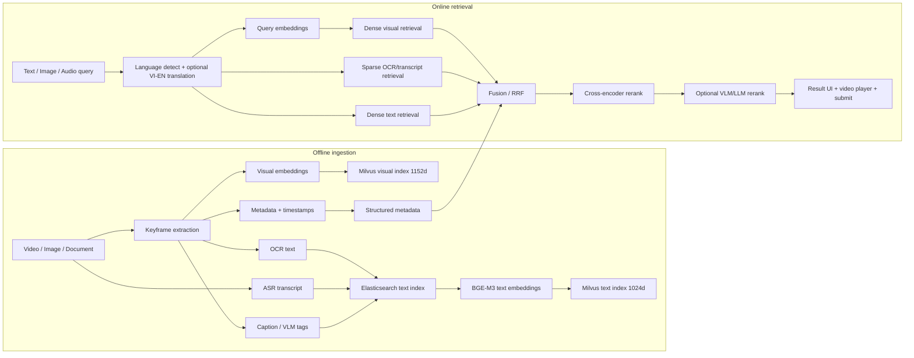

# Video Retrieval System for AI Challenge

Tài liệu này giải thích cách xây hệ thống truy xuất video đa phương thức cho AI Challenge theo hướng **nhanh, dễ debug, chính xác dần theo từng tầng**. Mục tiêu không phải nhồi một model thật lớn vào mọi thứ, mà là thiết kế pipeline biết kết hợp nhiều tín hiệu: hình ảnh, chữ trong frame, lời thoại, caption/ngữ cảnh và metadata thời gian.

Repo hiện tại đã được nâng theo hướng thi đấu: Flask backend làm API, Milvus cho dense vector search, Elasticsearch cho OCR/transcript/caption search, hybrid fusion bằng RRF, rerank top candidates, validate số chiều embedding, Whisper ASR, keyframe extraction, OCR/caption ingest và frontend React/Vite riêng để xem, pin, so sánh lân cận và submit frame.

## Cài Đặt Và Chạy Hệ Thống

Phần này là checklist chạy từ máy mới clone repo đến lúc search được. Dữ liệu runtime nằm trong `data/` nhưng Git chỉ track cấu trúc thư mục, không track video, keyframe, embedding, transcript, OCR hay caption sinh ra khi chạy.

### 1. Yêu cầu máy

```text
Python 3.10+
Node.js 20+
Docker Desktop / Docker Engine
NVIDIA GPU + driver CUDA
NVIDIA Container Toolkit nếu chạy backend bằng Docker GPU
```

### 2. Cài backend Python

```powershell
python -m venv .venv
.\.venv\Scripts\Activate.ps1
python -m pip install --upgrade pip
pip install -r requirements.txt
```

### 3. Cài frontend React

```powershell
cd frontend
npm install
npm run build
cd ..
```

Khi build xong, Flask sẽ serve UI từ `frontend/dist/`. Nếu muốn dev frontend riêng:

```powershell
cd frontend
npm run dev
```

### 4. Tạo cấu hình môi trường

```powershell
copy .env.example .env
```

Profile mạnh hiện tại:

```text
VISUAL_MODEL_PROVIDER=siglip2
VISUAL_MODEL=google/siglip2-so400m-patch16-naflex
VECTOR_DIMENSION=1152
ENABLE_QUERY_TRANSLATION=true
QUERY_TRANSLATION_MODEL=facebook/nllb-200-distilled-600M

ENABLE_DENSE_TEXT_RETRIEVAL=true
TEXT_MODEL_PROVIDER=sentence_transformers
TEXT_MODEL=BAAI/bge-m3
TEXT_VECTOR_DIMENSION=1024

RERANK_MODEL=BAAI/bge-reranker-v2-m3
ASR_MODEL=large-v3
OCR_ENGINE=paddleocr
```

Timing mặc định:

```text
KEYFRAME_INTERVAL_SECONDS=1.0
DEFAULT_FALLBACK_FPS=25.0
```

Mỗi video vẫn dùng FPS thật đọc từ file bằng OpenCV. `DEFAULT_FALLBACK_FPS` chỉ dùng khi file video không đọc được FPS.

### 5. Chạy database bằng Docker

```powershell
docker compose up -d etcd minio standalone elasticsearch redis
```

Kiểm tra services:

```powershell
docker compose ps
python -m scripts.validate_pipeline --check-services
```

### 6. Đặt video vào repo

Đặt video test hoặc video thi vào:

```text
data/videos/<video_id>.mp4
```

Ví dụ:

```text
data/videos/L01_V001.mp4
```

Tên file không có đuôi `.mp4` chính là `video_id`, dùng xuyên suốt cho keyframe, transcript, OCR, embedding và submit.

### 7. Chạy pipeline trích xuất offline

```powershell
python -m scripts.extract_keyframes --method interval --interval 1.0 --overwrite
python -m scripts.extract_text_from_keyframes --engine paddleocr --languages en,vi
python -m scripts.extract_transcripts --model large-v3 --language vi --vietnamese-prompt --device cuda
python -m scripts.compute_embeddings --batch-size 32 --device cuda
python -m backend.ingest_data
python -m scripts.validate_pipeline --check-services
```

`--overwrite` rất quan trọng khi đổi từ interval cũ sang `1.0s/frame`: nó xóa keyframe/map cũ của video rồi tạo lại từ đầu, tránh trường hợp map 2 giây cũ bị trộn với keyframe 1 giây mới. Sau khi overwrite keyframe, phải chạy lại `scripts.compute_embeddings` và `backend.ingest_data` để vector trong Milvus khớp đúng `keyframe_<id>.webp`.

Kết quả sinh ra:

```text
data/keyframes/      keyframe .webp và maps .csv
data/ocr_result/     OCR JSON
data/transcripts/    Whisper transcript JSON/CSV
data/embeddings/     SigLIP2 visual vectors .pt
Milvus               video_keyframes 1152d + video_text_embeddings 1024d
Elasticsearch        video_text_segments
```

### 8. Chạy backend và UI

Chạy local Python:

```powershell
python backend/app.py
```

Hoặc chạy backend bằng Docker GPU profile:

```powershell
docker compose --profile api up --build
```

Mở:

```text
http://localhost:5000
```

Health check:

```text
http://localhost:5000/api/health
```

### 8.1 Công thức submit tuyệt đối không được đổi

Evaluation server nhận milliseconds, không nhận frame index. UI/backend mới giữ đúng contract của repo cũ:

```text
Submit payload cuối cùng = videoId + timeMs
```

Với visual/OCR/caption result, backend đã map:

```text
keyframe_index / FrameID -> frame_number / OriginalFrame
```

Frontend tính:

```ts
const fps = result.fps || 25;
const frameNumber = result.frame_number;
const timeMs = Math.round((frameNumber / fps) * 1000);
```

Với transcript-only result, frontend ưu tiên timestamp segment:

```ts
const timeMs = Math.round(result.start_seconds * 1000);
```

Với video modal, khi tua từng frame rồi submit:

```ts
const currentFrame = Math.floor(video.currentTime * fps);
const timeMs = Math.round((currentFrame / fps) * 1000);
```

Backend `/api/submit` chỉ proxy payload này lên evaluation server:

```json
{
  "answerSets": [
    {
      "answers": [
        {
          "mediaItemName": "L22_V010",
          "start": "892760",
          "end": "892760"
        }
      ]
    }
  ]
}
```

Nếu công thức submit thay đổi, phải kiểm lại bằng `frame_number`, `fps`, `start_seconds` trong response `/search` trước khi thi.

### 9. Quy tắc dữ liệu khi push Git

Repo chỉ push cấu trúc `data/`:

```text
data/README.md
data/**/.gitkeep
```

Không push:

```text
data/videos/*.mp4
data/keyframes/**
data/embeddings/**
data/transcripts/**
data/ocr_result/**
data/captions/**
volumes/**
```

Như vậy người khác clone repo sẽ có đủ folder để chạy, nhưng không kéo theo video nặng, vector, keyframe hoặc dữ liệu riêng của cuộc thi.

## Ý Tưởng Cốt Lõi

Trong video retrieval, không nên phụ thuộc vào một loại score duy nhất.

Ví dụ query:

```text
người cầm ô đứng cạnh xe màu đỏ trong trời mưa
```

Một frame đúng có thể được phát hiện nhờ nhiều tín hiệu khác nhau:

- Visual embedding thấy cảnh có người, ô, xe, mưa.
- OCR thấy chữ trên biển hiệu hoặc phụ đề.
- Transcript/ASR nghe thấy lời thoại liên quan.
- Caption/VLM mô tả quan hệ giữa người, vật và bối cảnh.
- Metadata biết video id, timestamp, keyframe mapping, FPS.

Vì vậy hệ thống tốt nên có 3 tầng:

```text
1. Candidate generation: lấy thật nhanh nhiều ứng viên có khả năng đúng.
2. Fusion: gộp kết quả từ visual/OCR/transcript/caption.
3. Reranking: sắp xếp lại top kết quả để đáp án đúng lên cao.
```

## Sơ Đồ Luồng Tổng Quát



## Repo Hiện Tại Có Gì

| Phần | File chính | Trạng thái |
| --- | --- | --- |
| Flask API | [backend/app.py](backend/app.py) | Đã có |
| Search engine | [backend/retrieval_system.py](backend/retrieval_system.py) | Visual dense + sparse text + BGE-M3 dense text + RRF |
| Config | [backend/config.py](backend/config.py) | Đọc từ `.env`/environment variables |
| Ingest Milvus/ES | [backend/ingest_data.py](backend/ingest_data.py) | Visual collection 1152d + text collection 1024d + Elasticsearch |
| Keyframe extraction | [scripts/extract_keyframes.py](scripts/extract_keyframes.py) | Đã có |
| Visual embedding | [scripts/compute_embeddings.py](scripts/compute_embeddings.py) | SigLIP2 SO400M NaFlex 1152d mặc định |
| Dense text embedding | [utils/dense_text_encoder.py](utils/dense_text_encoder.py) | BGE-M3 1024d cho transcript/OCR/caption |
| Whisper transcript | [scripts/extract_transcripts.py](scripts/extract_transcripts.py) | Đã có |
| Web UI | [frontend](frontend) | React + Vite + TypeScript |
| Docker DB | [docker-compose.yml](docker-compose.yml) | Milvus + Elasticsearch |

Điểm đã nâng cấp và cần tiếp tục benchmark:

- Visual model mặc định đã chuyển sang `google/siglip2-so400m-patch16-naflex` 1152d; query tiếng Việt được dịch sang tiếng Anh trước khi dense visual search.
- OCR/transcript/caption có hai nhánh: Elasticsearch sparse để bắt exact/fuzzy keyword và BGE-M3 dense text để bắt semantic match.
- Fusion đã có RRF/hybrid, nhưng nên đo `nDCG@10`, `MRR@10`, `Recall@50` và latency theo từng tầng.
- Reranker mặc định dùng `BAAI/bge-reranker-v2-m3` qua `sentence-transformers`, frontend có toggle `Rerank Top-K`.
- Backend/model serving đã có Docker GPU profile; cần đảm bảo máy đã có NVIDIA Container Toolkit và đủ VRAM.

## Luồng Xử Lý Offline

Offline ingestion là phần chuẩn bị dữ liệu trước khi thi hoặc trước khi search. Làm tốt phần này thì online search mới nhanh.

### Lệnh chạy full pipeline khuyến nghị

```powershell
docker compose up -d etcd minio standalone elasticsearch redis

python -m scripts.extract_keyframes --method interval --interval 1.0 --overwrite
python -m scripts.extract_text_from_keyframes --engine paddleocr --languages en,vi
python -m scripts.extract_transcripts --model large-v3 --language vi --vietnamese-prompt --device cuda
python -m scripts.compute_embeddings --batch-size 32 --device cuda
python -m backend.ingest_data
python -m scripts.validate_pipeline --check-services
```

Sau khi đổi visual model hoặc `VECTOR_DIMENSION`, pipeline tự xử lý các phần liên quan:

- `scripts.compute_embeddings` mặc định xóa `keyframe_*.pt` cũ trong từng video trước khi ghi embedding mới, để không còn vector stale.
- `_metadata.json` ghi `provider`, `model_name`, `vector_dimension`, `truncate_dim`, `normalized`.
- `backend.ingest_data` mặc định drop/recreate Milvus collection rồi ingest lại embedding hiện tại.
- `scripts.validate_pipeline` báo lỗi nếu metadata/vector/keyframe count không khớp config hiện tại.

Chỉ dùng `--keep-existing` hoặc `--append-milvus` khi bạn chắc chắn không đổi model và muốn append thủ công.

Nếu dùng Docker backend:

```powershell
docker compose --profile api up --build
```

Backend có endpoint kiểm nhanh cấu hình thực tế:

```text
GET /api/health
```

### 1. Chuẩn bị video

Đưa video vào:

```text
data/videos/L01_V001.mp4
data/videos/L01_V002.mp4
```

Tên file nên là `video_id`, vì toàn bộ hệ thống dùng tên file để map keyframe, transcript, metadata và submit.

### 2. Extract keyframes

```powershell
python -m scripts.extract_keyframes --method interval --interval 1.0 --overwrite
```

Kết quả:

```text
data/keyframes/L01_V001/keyframe_0.webp
data/keyframes/L01_V001/keyframe_1.webp
data/keyframes/maps/L01_V001_map.csv
```

File map rất quan trọng:

```csv
FrameID,Seconds,OriginalFrame
0,0.0,0
1,2.0,50
2,4.0,100
```

Nó giúp biết `keyframe_1.webp` tương ứng giây nào và frame gốc nào trong video.

### 3. Tính visual embeddings

Baseline hiện tại:

```powershell
python -m scripts.compute_embeddings --batch-size 32 --device cuda
```

Kết quả:

```text
data/embeddings/L01_V001/keyframe_0.pt
data/embeddings/L01_V001/keyframe_1.pt
```

Model mặc định cho profile thi đấu là:

```text
VISUAL_MODEL_PROVIDER=siglip2
VISUAL_MODEL=google/siglip2-so400m-patch16-naflex
VECTOR_DIMENSION=1152
VISUAL_TRUNCATE_DIM=1152
MODEL_TRUST_REMOTE_CODE=true
ENABLE_QUERY_TRANSLATION=true
QUERY_TRANSLATION_MODEL=facebook/nllb-200-distilled-600M
```

Luồng query lúc chạy:

```text
Query tiếng Việt trên UI
-> backend detect tiếng Việt
-> NLLB dịch VI -> EN
-> SigLIP2 visual search bằng câu tiếng Anh
-> Elasticsearch vẫn search OCR/transcript bằng cả câu gốc và câu dịch
-> RRF fusion + BGE rerank
```

Lưu ý rất quan trọng: đổi từ OpenCLIP 512d hoặc Jina 1024d sang SigLIP2 1152d thì phải **recompute embeddings** và **recreate Milvus collection**. Hệ thống có guard dimension; nếu collection cũ khác 1152d, ingest/search sẽ báo lỗi thay vì search sai âm thầm.

Trong code hiện tại, hai bước này đã được nối vào pipeline: `compute_embeddings` tự dọn embedding cũ theo video, còn `backend.ingest_data` tự recreate Milvus collection mặc định. Vì vậy sau khi đổi model, chỉ cần chạy lại full pipeline phía trên.

### 4. Extract transcript bằng ASR

Mặc định thi đấu:

```powershell
python -m scripts.extract_transcripts --model large-v3 --language vi --vietnamese-prompt --device cuda
```

Khuyến nghị thi đấu:

```text
large-v3 + language=vi + vietnamese prompt: ưu tiên accuracy cho tiếng Việt
beam_size=5, best_of=5, temperature=0,0.2,0.4: cân bằng accuracy và chống kẹt decoding
condition_on_previous_text=true: giữ ngữ cảnh tốt hơn; tắt nếu thấy hallucination lặp
faster-whisper: nên dùng sau nếu cần tăng tốc inference ASR trên GPU
medium/small: dùng khi GPU yếu hoặc cần ingest nhanh
```

Transcript không phụ thuộc FPS để sinh timestamp; Whisper trả `start/end` theo giây. Khi ingest, hệ thống lấy `start` của segment và map sang keyframe gần nhất bằng `data/keyframes/maps/<video_id>_map.csv`, nên video 25 FPS, 29.97 FPS hay 50 FPS đều đi qua map thật của từng video.

Kết quả transcript nên có:

```json
{
  "video_id": "L01_V001",
  "language": "vi",
  "segments": [
    {
      "start": 12.3,
      "end": 15.1,
      "text": "..."
    }
  ]
}
```

### 5. OCR keyframes

Đây là phần rất nên thêm cho AI Challenge. Nhiều đáp án nằm trong:

- chữ trên màn hình,
- biển báo,
- logo,
- phụ đề,
- slide,
- bảng,
- tiêu đề chương trình.

Luồng đề xuất:

```text
keyframe images
-> PaddleOCR PP-OCRv5
-> OCR JSON
-> Elasticsearch text index
```

Không nên chạy VLM OCR nặng trên toàn bộ keyframe ngay từ đầu. Cách thực dụng:

```text
PaddleOCR nhẹ chạy toàn bộ corpus
PaddleOCR-VL hoặc Florence-2 chỉ chạy top candidates khi cần hiểu layout/chữ phức tạp
```

### 6. Caption hoặc VLM tags

Caption giúp bổ sung ngữ cảnh mà visual embedding đôi khi không biểu diễn rõ.

Ví dụ frame có:

```text
một người đàn ông mặc áo xanh đang đứng cạnh xe cứu thương
```

Caption text này có thể index vào Elasticsearch giống transcript/OCR. Tuy nhiên, caption/VLM khá nặng, nên ưu tiên sau OCR và transcript.

### 7. Ingest vào database

```powershell
python -m backend.ingest_data
```

Hiện script làm 2 việc:

- Ingest embedding `.pt` vào Milvus collection `video_keyframes`.
- Ingest transcript JSON/CSV vào Elasticsearch index `video_transcripts`.

Sau này nên mở rộng để ingest thêm:

```text
OCR text
caption text
text dense embedding
model metadata
timestamp metadata
```

## Luồng Xử Lý Online Khi User Search

Online retrieval là phần chạy khi người dùng nhập query trên UI.

### Bước 1. Nhận query

Ví dụ:

```json
{
  "description": "người cầm ô đứng cạnh xe màu đỏ"
}
```

Hoặc:

```json
{
  "transcript": "hôm nay trời mưa rất lớn"
}
```

### Bước 2. Tiền xử lý query

Nên làm:

- detect tiếng Việt/Anh,
- chuẩn hóa dấu câu/khoảng trắng,
- optional dịch Việt -> Anh nếu visual model hiểu tiếng Anh tốt hơn,
- giữ cả query gốc và query dịch.

Ví dụ:

```text
query_vi = "người cầm ô đứng cạnh xe màu đỏ"
query_en = "a person holding an umbrella standing next to a red car"
```

Sau đó search cả hai nếu latency cho phép.

### Bước 3. Dense visual retrieval

Query text được encode thành vector, rồi search Milvus:

```text
query -> text encoder -> vector -> Milvus -> top 200/500 keyframes
```

Kết quả gồm:

```json
{
  "video_id": "L01_V001",
  "keyframe_index": 17,
  "frame_number": 850,
  "start_seconds": 34.0,
  "clip_score": 0.337
}
```

### Bước 4. Sparse text retrieval

Query cũng search trên Elasticsearch:

```text
query -> Elasticsearch -> transcript/OCR/caption matches
```

Text search rất mạnh khi query chứa tên riêng, số, chữ trên màn hình hoặc lời thoại.

### Bước 5. Fusion

Không nên so trực tiếp:

```text
CLIP score 0.33
Elasticsearch score 12.5
OCR score 8.1
```

Vì mỗi hệ có scale khác nhau. Cách dễ và ổn nhất là dùng RRF:

```text
rrf_score = sum(1 / (k + rank_i))
```

Với `k = 60`.

Ví dụ:

```text
Frame A rank visual = 2, rank OCR = 20
Frame B rank visual = 10, rank OCR = 1
```

RRF sẽ gộp theo thứ hạng, không cần ép score về cùng scale.

### Bước 6. Rerank

Sau fusion, lấy top 50 đưa vào reranker:

```text
query + OCR + transcript + caption + metadata -> reranker -> final ranking
```

Reranker khuyến nghị:

```text
BAAI/bge-reranker-v2-m3
```

Vì model này multilingual, hợp Việt-Anh và nhẹ hơn các reranker LLM lớn.

### Bước 7. UI và submit

Frontend hiển thị result card. Khi click:

- mở video,
- seek tới `start_seconds`,
- cho nhảy từng frame,
- tính `timeMs`,
- submit lên evaluation server.

Công thức submit:

```text
currentFrame = floor(currentTime * fps)
timeMs = round((currentFrame / fps) * 1000)
```

## Vì Sao Score 0.3x Vẫn Có Thể Là Cao

Score từ CLIP/SigLIP/OpenCLIP không phải phần trăm đúng.

Nó thường là cosine similarity hoặc inner product giữa query vector và image vector. Với CLIP baseline, score đúng có thể chỉ quanh:

```text
0.20 - 0.25: liên quan nhẹ
0.25 - 0.32: khá liên quan
0.32 - 0.40: thường đã rất tốt
> 0.40: rất mạnh, nhưng không phải query nào cũng có
```

Vì vậy nếu bạn thấy frame đúng chỉ `0.3x`, đó là bình thường.

Điều quan trọng là **rank tương đối**, không phải raw score tuyệt đối.

Ví dụ tốt:

```text
Top 1: 0.337
Top 2: 0.331
Top 3: 0.329
Top 50: 0.284
```

Điểm nhìn thấp nhưng top đầu vẫn có ý nghĩa.

Ví dụ rất mạnh:

```text
Top 1: 0.337
Top 2: 0.180
Top 3: 0.175
```

Top 1 nổi bật hẳn so với phần còn lại.

Do đó không nên đặt threshold kiểu:

```text
score > 0.7 mới đúng
```

Thay vào đó nên đo:

```text
Recall@50
MRR@10
nDCG@10
rank của đáp án đúng
```

## Cách Tính Điểm Nên Dùng

### Cách đơn giản nhất: RRF

RRF hợp cho giai đoạn đầu vì không cần normalize score.

```python
def rrf(rank, k=60):
    return 1 / (k + rank)
```

Final:

```text
final_score = rrf_visual + rrf_ocr + rrf_transcript + metadata_bonus
```

### Cách weighted nếu đã normalize tốt

```text
final_score =
  0.45 * visual_rank_score
+ 0.30 * ocr_rank_score
+ 0.20 * transcript_rank_score
+ 0.05 * metadata_bonus
```

Gợi ý cho AI Challenge:

- Query mô tả cảnh: tăng visual weight.
- Query chứa chữ/số/tên riêng: tăng OCR weight.
- Query giống lời thoại: tăng transcript weight.
- Query mơ hồ: lấy rộng hơn, rerank mạnh hơn.

## Model Stack Khuyến Nghị

| Tầng | Nên dùng trước | Khi nào dùng |
| --- | --- | --- |
| Visual baseline | OpenCLIP ViT-B-32 | Đã có, nhanh, dùng làm baseline |
| Visual nâng cấp | SigLIP2 base/so400m | Query cảnh tự nhiên, object, relation |
| Multilingual image-text | jina-clip-v2 | Query Việt-Anh nhiều, cần text-image chung |
| OCR toàn bộ corpus | PaddleOCR PP-OCRv5 | Nên thêm sớm |
| OCR/VLM fallback | PaddleOCR-VL hoặc Florence-2 | Dùng top candidates, layout/chữ phức tạp |
| ASR | faster-whisper large-v3 | Transcript chất lượng cao và nhanh trên GPU |
| Text embedding | BAAI/bge-m3 | Dense text retrieval đa ngôn ngữ |
| Reranker | BAAI/bge-reranker-v2-m3 | Rerank top 50 |
| Serving | ONNX/TensorRT/Triton | Khi cần throughput và batching |
| Cache | Redis | Cache query embedding, translation, rerank |

## Thứ Tự Làm Khuyến Nghị

Đừng làm tất cả cùng lúc. Với thi đấu, nên đi từng bước:

### Giai đoạn 1: Baseline chạy chắc

1. Chạy Docker Milvus + Elasticsearch.
2. Extract keyframes.
3. Compute OpenCLIP embeddings.
4. Extract transcript.
5. Ingest Milvus + Elasticsearch.
6. Search được bằng UI.
7. Submit đúng `timeMs`.

Mục tiêu: hệ thống không lỗi, search được, submit đúng.

### Giai đoạn 2: Tăng accuracy rẻ nhất

1. Thêm OCR bằng PaddleOCR.
2. Index OCR text vào Elasticsearch.
3. Search song song visual + OCR + transcript.
4. Fusion bằng RRF.

Mục tiêu: tăng recall mạnh, đặc biệt query có chữ trong ảnh.

### Giai đoạn 3: Nâng visual model

1. Thêm adapter để đổi model embedding.
2. Benchmark OpenCLIP vs SigLIP2 vs jina-clip-v2.
3. Chọn model theo corpus và GPU.

Mục tiêu: visual retrieval tốt hơn baseline.

### Giai đoạn 4: Rerank

1. Lấy top 50 sau fusion.
2. Ghép text context:

```text
video_id, timestamp, OCR, transcript, caption
```

3. Rerank bằng `bge-reranker-v2-m3`.

Mục tiêu: đưa đáp án đúng lên top 1/top 5.

### Giai đoạn 5: Tối ưu backend

1. Chuyển config sang `.env`.
2. Thêm Redis cache.
3. Container hóa backend/worker.
4. Tối ưu batch inference.
5. Nếu cần, dùng Triton/ONNX/TensorRT.

Mục tiêu: giảm latency và dễ deploy khi thi.

## Roadmap UI Và Prototype Tiếp Theo

Phần này ghi lại các ý tưởng nên đưa vào giao diện mới. Mục tiêu là làm UI không chỉ đẹp hơn, mà giúp thao tác thi AIC nhanh hơn: tìm, so sánh, ghim, kiểm tra frame lân cận và submit ít sai hơn.

### Nhóm Chức Năng Nên Làm Sớm

#### 1. OCR hint riêng

Dùng khi query chính mô tả cảnh, nhưng muốn ép hệ thống tìm thêm chữ cụ thể trong frame.

Ví dụ:

```text
Query chính: người đứng gần xe đỏ
OCR hint: biển hiệu màu xanh / chữ Viettel / số 52
```

Backend nên gửi:

```json
{
  "description": "người đứng gần xe đỏ",
  "ocr": "Viettel số 52"
}
```

Tác dụng:

- Visual search vẫn tập trung vào cảnh.
- OCR search tập trung vào chữ.
- Fusion/RRF gộp cả hai, tránh query quá dài làm visual embedding bị nhiễu.

#### 2. Transcript hint riêng

Dùng khi video có lời thoại/phụ đề, hoặc query có cụm nghe được trong audio.

Ví dụ:

```text
Query chính: cảnh họp báo
Transcript hint: chúng tôi sẽ triển khai trong tuần tới
```

Backend nên gửi:

```json
{
  "description": "cảnh họp báo",
  "transcript": "chúng tôi sẽ triển khai trong tuần tới"
}
```

Tác dụng:

- Không nhồi lời thoại vào visual query.
- Transcript search giúp khóa đúng video/timestamp.
- Rất hữu ích khi hình ảnh nhiều cảnh giống nhau nhưng lời thoại khác nhau.

#### 3. Rerank Top-K toggle

Search nhanh bằng Milvus/Elasticsearch trước, sau đó chỉ rerank top candidates.

Gợi ý UI:

```text
[ ] Rerank top 20
[x] Rerank top 50
[ ] Rerank top 100
```

Gợi ý backend:

```json
{
  "description": "...",
  "rerank_top_k": 50
}
```

Tác dụng:

- Tắt rerank khi cần tốc độ.
- Bật rerank khi query khó hoặc kết quả top đầu chưa chắc.
- Giữ latency trong mức kiểm soát.

#### 4. Neighbor expansion

Sau khi tìm được top frame, tự thêm hoặc hiển thị frame lân cận:

```text
frame - 5s
frame - 3s
frame
frame + 3s
frame + 5s
```

Lý do:

- Đáp án AIC thường không nằm đúng frame được search ra.
- Keyframe có thể chỉ gần đúng, còn frame submit cần lệch vài giây.
- Tăng khả năng tìm đúng timestamp mà không phải kéo video thủ công.

Nên triển khai 2 lớp:

- Backend có thể trả thêm `nearby_candidates`.
- Modal UI hiển thị nearby frames để nhảy nhanh.

#### 5. Confidence explanation

Mỗi card nên có breakdown nhỏ:

```text
Visual: 0.337
OCR rank: 4
Transcript rank: 12
Fusion: 0.048
Rerank: 2.91
```

Tác dụng:

- Biết result mạnh vì hình, vì chữ hay vì transcript.
- Debug retrieval nhanh hơn.
- Giúp quyết định nên sửa query theo hướng visual/OCR/transcript.

Backend hiện đã có các field có thể dùng:

```text
clip_score
source_scores
source_ranks
fusion_score
rerank_score
sources
```

#### 6. Auto OCR highlight

Nếu OCR match chữ nào, highlight ngay trên card.

Ví dụ:

```text
OCR: "Viettel"
OCR: "Bến xe"
OCR: "Cấm đỗ xe"
```

Tác dụng:

- Không cần mở video vẫn biết vì sao frame được trả về.
- Scan kết quả nhanh hơn nhiều với query có chữ/số/biển hiệu.

Gợi ý:

- Highlight substring trong `ocr_text`.
- Nếu query có `ocr`, ưu tiên highlight theo OCR hint.
- Nếu OCR text dài, chỉ show đoạn chứa match.

### Nhóm Chức Năng Hỗ Trợ Khi Thi

#### 7. Submit history

Lưu lịch sử đã submit:

```text
video_id
frame
timestamp
query
score
status: success / failed
```

Tác dụng:

- Tránh submit trùng.
- Biết frame nào đã thử.
- Khi submit fail vẫn giữ lại candidate để chỉnh timestamp.

Gợi ý lưu:

- Giai đoạn đầu: `localStorage`.
- Sau đó: backend SQLite/JSONL để không mất lịch sử khi refresh.

#### 8. Shortlist / Pin frame

Ghim những frame nghi ngờ đúng vào một thanh riêng để so sánh hoặc submit sau.

Tác dụng:

- Top 1 chưa chắc đúng, nhưng top 3-5 thường có vài frame tiềm năng.
- Khi query khó, người dùng cần gom candidate trước khi quyết định.

Gợi ý UI:

```text
[Pin] trên mỗi result card
Pinned strip dưới/top màn hình
Click pinned item -> mở modal đúng timestamp
```

#### 9. Compare mode

Cho phép pin 2-4 frame rồi mở so sánh cùng lúc.

Tác dụng:

- Hữu ích khi nhiều frame giống nhau nhưng khác thời điểm.
- So sánh biển hiệu, background, nhân vật, camera angle nhanh hơn.

Nên làm sau khi đã có Shortlist/Pin frame.

#### 10. Nearby frames trong modal

Khi mở một frame, modal hiện các frame lân cận cùng video để nhảy nhanh qua các timestamp gần đó.

Ví dụ:

```text
-5s  -3s  current  +3s  +5s
```

Tác dụng:

- Cực cần cho AIC vì search thường ra gần đúng.
- Người dùng không phải kéo timeline thủ công.
- Kết hợp tốt với frame-step hiện có.

#### 11. Hotkey strip

Thêm gợi ý phím tắt:

```text
Enter: Search
Space: Play/Pause
←/→: Step frame
A/D: Nearby prev/next
P: Pin
S: Submit
Esc: Close modal
```

Giai đoạn prototype có thể chỉ hiển thị strip. Khi code thật, implement bằng `keydown`.

#### 12. Query decomposition

Backend tự tách query dài thành:

```text
visual_query
ocr_query
transcript_query
negative_query
```

Ví dụ:

```text
Input:
người đàn ông mặc áo trắng đứng trước cửa hàng có chữ pharmacy

visual_query:
man wearing white shirt standing in front of a store

ocr_query:
pharmacy
```

Tác dụng:

- Tăng độ chính xác vì mỗi modality nhận đúng loại thông tin.
- Visual embedding không bị nhiễu bởi text cụ thể.
- OCR search không bị nhiễu bởi mô tả cảnh.

Nên triển khai theo 2 giai đoạn:

1. Rule-based:

```text
"có chữ X" -> ocr_query
"biển hiệu X" -> ocr_query
"nói rằng X" -> transcript_query
"không có X" -> negative_query
phần còn lại -> visual_query
```

2. LLM/local model:

```text
Input query -> structured JSON query plan
```

### Payload Search Đề Xuất Cho UI Mới

UI mới nên gửi một payload giàu thông tin hơn:

```json
{
  "description": "người đứng gần xe đỏ",
  "ocr": "Viettel số 52",
  "transcript": "đang triển khai trong tuần tới",
  "negative": "không phải xe máy",
  "fusion": "rrf",
  "rerank_top_k": 50,
  "neighbor_seconds": [-5, -3, 0, 3, 5],
  "explain": true
}
```

Backend hiện đã hiểu tốt các field:

```text
description
ocr
transcript
audio
caption
fusion
```

Các field nên thêm tiếp:

```text
negative
rerank_top_k
neighbor_seconds
explain
```

### Thứ Tự Ưu Tiên Cho Giao Diện Mới

Nên làm theo thứ tự:

1. OCR hint riêng.
2. Transcript hint riêng.
3. Confidence explanation.
4. Auto OCR highlight.
5. Shortlist / Pin frame.
6. Nearby frames trong modal.
7. Submit history.
8. Rerank Top-K toggle.
9. Hotkey strip.
10. Compare mode.
11. Query decomposition rule-based.
12. Query decomposition bằng LLM/local model.

Nếu cần bản tối thiểu để thi nhanh:

```text
OCR hint + Transcript hint + Pin frame + Nearby frames + Confidence explanation
```

## Docker Và GPU

Hiện repo có:

```powershell
docker compose up -d
```

Services:

- Milvus
- Etcd
- MinIO
- Elasticsearch

Nên thêm sau:

```text
backend-api
worker-ingest
model-embedder
model-reranker
redis
triton optional
```

Yêu cầu GPU:

```text
8 GB VRAM: chạy baseline, OCR, embedding vừa phải
12-16 GB VRAM: SigLIP2/jina-clip-v2 + faster-whisper thoải mái hơn
24 GB VRAM: reranker/VLM nặng hơn, batch lớn hơn
```

## Cấu Hình Nên Chuyển Sang .env

Hiện [backend/config.py](backend/config.py) còn hardcode. Nên chuyển dần:

```env
MILVUS_HOST=localhost
MILVUS_PORT=19530
ELASTIC_HOST=localhost
ELASTIC_PORT=9200

VISUAL_MODEL=openclip-vit-b-32
TEXT_MODEL=BAAI/bge-m3
RERANK_MODEL=BAAI/bge-reranker-v2-m3
ASR_MODEL=large-v3
OCR_ENGINE=paddleocr

EVAL_SERVER_URL=http://192.168.20.156:5601
SESSION_ID=...
EVALUATION_ID=...
```

Không nên commit session thật nếu repo public.

## Cách Chạy Hiện Tại

### 1. Cài dependencies

```powershell
python -m venv .venv
.venv\Scripts\activate
pip install -r requirements.txt
```

### 2. Chạy database

```powershell
docker compose up -d
```

### 3. Kiểm tra môi trường

```powershell
python -m scripts.setup_environment --all
```

### 4. Chuẩn bị dữ liệu

```powershell
python -m scripts.extract_keyframes --method interval --interval 1.0 --overwrite
python -m scripts.compute_embeddings --batch-size 32 --device cuda
python -m scripts.run_transcript_pipeline --model large --language vi
python -m backend.ingest_data
```

### 5. Chạy web

```powershell
python -m backend.app
```

Mở:

```text
http://localhost:5000
```

## API Chính

### Search visual

```http
POST /search
Content-Type: application/json
```

```json
{
  "description": "người cầm ô đứng cạnh xe màu đỏ"
}
```

### Search transcript

```json
{
  "transcript": "hôm nay trời mưa rất lớn"
}
```

### Submit

```http
POST /api/submit
Content-Type: application/json
```

```json
{
  "sessionId": "...",
  "evaluationId": "...",
  "videoId": "L01_V001",
  "timeMs": 35680
}
```

## Metrics Cần Theo Dõi

Trong thi đấu, nên log theo từng tầng:

| Metric | Ý nghĩa |
| --- | --- |
| Recall@50 | Candidate generation có bắt được đáp án không |
| Recall@100 | Search rộng có đủ tốt không |
| MRR@10 | Đáp án đúng lên sớm thế nào |
| nDCG@10 | Ranking top đầu tốt không |
| Latency per stage | Chậm ở embedding, DB, fusion hay rerank |
| GPU memory | Model có vừa GPU không |
| Cache hit rate | Cache có giúp giảm latency không |

Latency budget gợi ý:

| Stage | Mục tiêu |
| --- | ---: |
| Query preprocessing + embedding | < 100 ms nếu cache miss |
| Dense retrieval | < 100-200 ms |
| Sparse retrieval | < 100-200 ms |
| Fusion | < 20 ms |
| Rerank top 50 | 200-800 ms tùy GPU/model |
| Total interactive search | 0.5-2.0 s |

## Checklist Khi Debug Search

Nếu kết quả không tốt, kiểm tra theo thứ tự:

1. Keyframe map có đúng `Seconds` và `OriginalFrame` không?
2. FPS đọc từ video có đúng không?
3. Embedding có normalize không?
4. Milvus metric là `COSINE` hay `IP`?
5. Query tiếng Việt có cần dịch sang tiếng Anh không?
6. Top 50 visual có chứa đáp án không?
7. Elasticsearch transcript/OCR có index đúng video_id và timestamp không?
8. Fusion có cắt candidate quá sớm không?
9. Reranker input có đủ OCR/transcript/caption context không?
10. Submit dùng millisecond hay frame number?

## Nguồn Tham Khảo Model Và Công Nghệ

- SigLIP 2: https://arxiv.org/abs/2502.14786
- jina-clip-v2: https://huggingface.co/jinaai/jina-clip-v2
- PaddleOCR-VL: https://www.paddleocr.ai/main/en/version3.x/pipeline_usage/PaddleOCR-VL.html
- Milvus multi-vector hybrid search: https://milvus.io/docs/multi-vector-search.md
- Docker GPU support: https://docs.docker.com/compose/how-tos/gpu-support/
- Triton dynamic batching: https://docs.nvidia.com/deeplearning/triton-inference-server/
- BGE reranker v2: https://bge-model.com/bge/bge_reranker_v2.html

## Current Fast Accuracy Profile

Hệ thống hiện dùng profile ưu tiên chất lượng nhưng vẫn giữ query nhanh trên GPU:

```text
Visual dense retrieval:
  collection: video_keyframes
  model: google/siglip2-so400m-patch16-naflex
  vector field: keyframe_vector
  dimension: 1152

Dense text retrieval:
  collection: video_text_embeddings
  model: BAAI/bge-m3
  vector field: text_vector
  dimension: 1024

Sparse text retrieval:
  engine: Elasticsearch
  fields: text, ocr_text, caption

Fusion:
  method: weighted RRF
  sources: visual, transcript, ocr, caption, text_dense

Rerank:
  model: BAAI/bge-reranker-v2-m3
  scope: top K only
```

Không trộn vector ảnh và vector text vào cùng collection. SigLIP2 là `1152d`, còn BGE-M3 dense text là `1024d`; `backend.ingest_data` và `scripts.validate_pipeline --check-services` đều kiểm tra schema để tránh search sai do lệch dimension.
